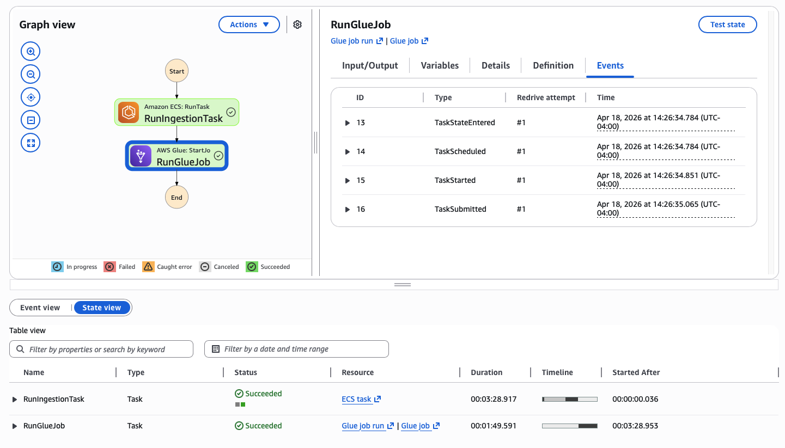

# Oklahoma General Ledger Pipeline

Serverless data pipeline on AWS that ingests, transforms, and serves Oklahoma state expenditure data for analysis.

## Architecture

```
EventBridge Scheduler (monthly)
          │
          ▼
  Step Functions
  ├── ECS Fargate (ingest) ──→ S3 raw ──→ Glue (transform) ──→ S3 silver ──→ Athena
  │         │
  │     DynamoDB (CDC metadata)
  │
  └── EventBridge (success/failure) ──→ SNS ──→ Email alerts
```

Raw CSV files are fetched from the CKAN API and written to S3. Glue transforms them into partitioned Parquet. Athena queries the silver layer directly via partition projection, no crawler is needed.

ECS Fargate, Glue, and Athena all provision and tear down on demand, and costs accrue only when the pipeline is running. For a monthly batch workload this is significantly cheaper than keeping an always-on cluster or VM.

The silver layer is the serving layer for this project. It can be extended with gold-layer views in Athena or a tool like dbt depending on the analytical use case.

**Design Decisions**

- **Cold start latency**: Fargate spins up in ~1.5 minutes, Glue in ~2 minutes. Total end-to-end on an incremental run is around 3-4 minutes. Acceptable for a monthly batch job, not suitable for near-real-time use cases.
- **Glue cost model**: Glue bills per DPU-second with a 1-minute minimum. Each Oklahoma GL file exceeds 100MB, making Lambda's memory ceiling a real constraint — Glue was chosen specifically to handle the file sizes without workarounds.
- **Athena query cost**: Athena charges per byte scanned. Parquet + partition pruning keeps this low, but ad-hoc exploratory queries across all years can add up without the 1GB scan limit enforced by the workgroup.


*Step Functions execution graph: ECS ingestion followed by Glue transformation*

## Infrastructure

All resources defined as CloudFormation, deployed via `make` targets in `infra/`.

| Stack | Description |
|---|---|
| `okgl-iam` | IAM roles and policies for Glue, ECS, Step Functions, and EventBridge |
| `okgl-metadata` | DynamoDB table for CDC metadata |
| `okgl-ecr` | ECR repository for the ingestion container image |
| `okgl-ecs` | ECS Fargate cluster and task definition |
| `okgl-glue` | Glue ETL job definition |
| `okgl-athena` | Glue Data Catalog table and Athena workgroup |
| `okgl-stepfunctions` | Step Functions state machine, SNS alerts, and EventBridge monthly scheduler |

## Deploy Order

```bash
# IAM roles and policies — deploy first, everything else depends on these
make deploy-iam

# DynamoDB table for tracking which files have already been ingested
make deploy-dynamodb

# ECR repository to hold the ingestion container image
make deploy-ecr

# Build the Docker image and push it to ECR
make build-push-image

# ECS Fargate cluster and task definition referencing the image above
make deploy-ecs

# Glue ETL job definition — reads raw CSVs, writes partitioned Parquet to silver
make deploy-glue

# Glue Data Catalog table and Athena workgroup for querying silver data
make deploy-athena

# Step Functions state machine, SNS alerts, and monthly EventBridge scheduler
# SUBNET_ID / SG_ID: default VPC values — run `make get-vpc-ids` to look them up
make deploy-stepfunctions SUBNET_ID=subnet-xxx SG_ID=sg-xxx ALERT_EMAIL=you@example.com
```

## Project Structure

```
src/
  ingestion/    # CKAN API fetch logic
  s3/           # S3 read/write helpers
  metadata/     # DynamoDB CDC metadata
  config/       # Constants and S3 paths
  glue_jobs/    # PySpark transformation (runs on AWS Glue)
infra/
  cloudformation/   # CloudFormation templates
  Makefile          # Deploy and container commands
run_pipeline.py     # Container entry point
```

## Data Source

Oklahoma General Ledger data is published by the Oklahoma Office of Management and Enterprise Services (OMES) through [data.ok.gov](https://data.ok.gov/dataset/general-ledger), a CKAN-based open data portal. CKAN exposes a metadata API that returns resource listings for each dataset — including file URLs, last-modified timestamps, and fiscal year labels. The ingestion pipeline uses this API to detect new or updated files on each run, avoiding full re-downloads when nothing has changed.

- **License**: [CC-BY](https://creativecommons.org/licenses/by/4.0/)
